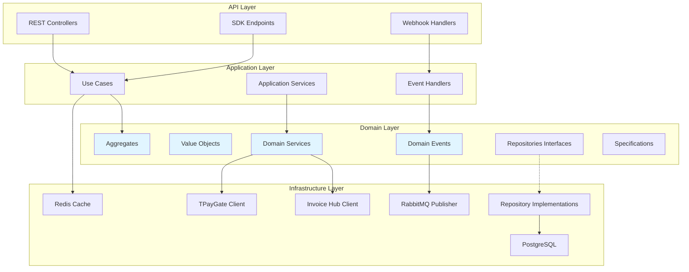

# Billing Service

## Purpose
Billing Service is the unified financial platform for the WION ecosystem, managing payments, credit consumption, wallet operations, and invoice generation for all products including WION POS, WION FnB, WION SPA, WIPIX, AI Services, and Platform Services.

## Responsibilities
- **Wallet Management**: Create and manage digital wallets for tenants
- **Payment Processing**: Integrate with TPayGate for QR code payments
- **Credit Operations**: Handle credit consumption, refunds, and adjustments
- **Webhook Handling**: Process payment gateway callbacks securely
- **Invoice Integration**: Trigger electronic invoice generation via Invoice Hub
- **Ledger & Audit**: Maintain double-entry accounting for all transactions
- **Client SDK**: Provide developer-friendly SDKs for easy integration

## Bounded Context
Billing Service operates within the **Financial Operations** bounded context, handling all monetary transactions, credit management, and financial reporting.

### Ubiquitous Language
- **Wallet**: Digital wallet belonging to a tenant
- **Wi Credit**: Internal payment unit (1 VNĐ = 1 Wi Credit)
- **Reserved Balance**: Funds temporarily locked for pending transactions
- **Ledger**: Double-entry accounting record
- **Tenant**: Business entity using WION platform

---

## Documentation Structure

This documentation follows **Domain-Driven Design (DDD)** principles with business knowledge organized by domain rather than feature.

```
Billing Service (Financial Operations Bounded Context)
│
├─ Domains (Business Knowledge - Single Source of Truth)
│  ├─ Wallet Domain
│  ├─ Payment Domain
│  ├─ Credit Transaction Domain
│  ├─ Ledger Domain
│  └─ Invoice Domain
│
├─ Policies (Cross-Aggregate Business Logic)
│  ├─ Invoice After Payment Policy
│  └─ Refund Policy
│
├─ Use Cases (Application Layer)
│  ├─ Consume Credit
│  ├─ Process Payment
│  ├─ Handle Webhook
│  └─ Create Invoice
│
├─ APIs
├─ Events
├─ Infrastructure
└─ Architecture
```

---

## Quick Navigation

### Start Here
- [**Domain Overview**](./domains/) - Business knowledge organized by Aggregate
- [**Use Cases**](./application/use-cases/) - Application workflows
- [**API Documentation**](./api/) - API contracts

### By Domain
- [**Wallet Domain**](./domains/wallet/) - Wallet and balance management
- [**Payment Domain**](./domains/payment/) - Payment processing
- [**Credit Transaction Domain**](./domains/credit-transaction/) - Credit consumption
- [**Ledger Domain**](./domains/ledger/) - Double-entry accounting
- [**Invoice Domain**](./domains/invoice/) - Invoice generation

### By Concern
- [**Policies**](./policies/) - Cross-aggregate business policies
- [**APIs**](./api/) - API reference
- [**Events**](./events/) - Event catalog
- [**Architecture**](./architecture/) - System architecture
- [**Reference**](./reference/) - Glossary and reference materials

---

## Key Principles

### Single Source of Truth
Business knowledge exists in exactly one place:
- **Aggregates** → `domains/{aggregate}/aggregate.md`
- **Business Rules** → `domains/{aggregate}/business-rules.md`
- **Lifecycle** → `domains/{aggregate}/lifecycle.md`
- **Domain Events** → `domains/{aggregate}/domain-events.md`
- **Model** → `domains/{aggregate}/model.md`

### Clean Architecture
```
Domain Layer (Business Rules)
    ↓
Application Layer (Use Cases)
    ↓
API Layer (Endpoints)
    ↓
Infrastructure Layer (Database, External Services)
```

### DDD Compliance
- Business rules ONLY in Domain layer
- Use Cases orchestrate, don't implement business logic
- Aggregates are transaction boundaries
- Cross-aggregate coordination via Policies

---

## Technology Stack
- **Language**: Node.js/TypeScript
- **Database**: PostgreSQL with read replicas
- **Cache**: Redis for balance caching
- **Message Queue**: RabbitMQ for events
- **External**: TPayGate (Payment Gateway), Invoice Hub (Electronic Invoicing)

---

## Architecture Overview

### Clean Architecture Layers



**Key Principle**: Business rules live ONLY in Domain Layer. Never in Controllers, Infrastructure, or Database.

---

## Domain Model

### Aggregates

#### 1. Wallet Aggregate
**Purpose**: Manage tenant wallet and balances

**Aggregate Root**: `Wallet`

**Entities**:
- `Wallet` (Root) - Tenant wallet with balance tracking
- `WalletAsset` - Multi-asset support (Wi Credit, Promotion, Gift, Trial)

**Value Objects**:
- `Balance` - Immutable balance representation
- `Currency` - Currency type (VND)
- `AssetType` - Asset classification (WI_CREDIT, PROMOTION, GIFT, TRIAL, AI_TOKEN)

**Business Invariants**:
- Balance cannot be negative: `balance >= 0`
- Reserved balance cannot be negative: `reserved_balance >= 0`
- One wallet per tenant
- One asset per type per wallet

**Transaction Boundary**: Single wallet per transaction

#### 2. Payment Aggregate
**Purpose**: Track payment transactions from initiation to completion

**Aggregate Root**: `Payment`

**Entities**:
- `Payment` (Root) - Payment transaction tracking
- `PaymentWebhook` - Webhook events for payment

**Value Objects**:
- `PaymentAmount` - Amount with currency
- `PaymentStatus` - Status (PENDING, PROCESSING, COMPLETED, FAILED, CANCELLED)
- `PaymentMethod` - Method type (QR, BANK_TRANSFER, CREDIT_CARD, E_WALLET)
- `GatewayReference` - External gateway reference

**Business Invariants**:
- Payment amount must be positive
- Payment status must transition through valid states
- Completed payments cannot be modified
- Expired payments auto-cancel

**Transaction Boundary**: Single payment per transaction

#### 3. CreditTransaction Aggregate
**Purpose**: Handle credit consumption and refunds

**Aggregate Root**: `CreditTransaction`

**Value Objects**:
- `TransactionAmount` - Amount with currency
- `TransactionType` - Type (CONSUME, REFUND, ADJUSTMENT)
- `TransactionStatus` - Status (PENDING, COMPLETED, FAILED, REVERSED)
- `IdempotencyKey` - Unique operation identifier

**Business Invariants**:
- Transaction amount must be positive
- Idempotency key must be unique
- Refund cannot exceed original transaction amount
- Transaction idempotency must be maintained

**Transaction Boundary**: Single credit transaction per transaction

#### 4. Ledger Aggregate
**Purpose**: Maintain double-entry accounting for audit trail

**Aggregate Root**: `LedgerEntry`

**Value Objects**:
- `Account` - Account identifier (debit/credit)
- `EntryAmount` - Amount with currency
- `TransactionReference` - Reference to source transaction

**Business Invariants**:
- Every transaction must have equal debit and credit entries: Σ Debit = Σ Credit
- Ledger entries are immutable (append-only)
- All financial operations must create ledger entries

**Transaction Boundary**: Single ledger entry creation

#### 5. Invoice Aggregate
**Purpose**: Map payments to electronic invoices

**Aggregate Root**: `InvoiceReference`

**Value Objects**:
- `InvoiceNumber` - Invoice identifier
- `InvoiceType` - Type (BAN_HANG, PHIEN_GIA_DICH, KHAC)
- `InvoiceStatus` - Status (PENDING, ISSUED, FAILED, CANCELLED)

**Business Invariants**:
- One invoice per payment
- Invoice number must be unique
- Failed invoice creation must be retried

**Transaction Boundary**: Single invoice reference per transaction

---

## Related Documentation
- [Database Schema](./infrastructure/database.md)
- [External Services](./infrastructure/external-services.md)
- [Dependency Map](./architecture/dependency-map.md)
- [Event Catalog](./events/README.md)
- [Glossary](./reference/glossary.md)

---

## Support
For questions or contributions, refer to the service documentation or contact the architecture team.
