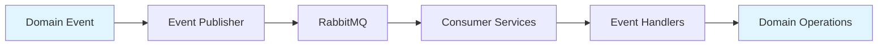

# Billing Service - Event Catalog

## Overview
Billing Service publishes and subscribes to events for financial operation tracking and integration with other services in the WION ecosystem.

## Published Events

### Wallet Events

#### WalletCreated
- **Trigger**: When a new wallet is created
- **Consumers**: Ledger Service, Analytics Service
- **Documentation**: [Wallet Domain Events](../domains/wallet/domain-events.md)

#### BalanceChanged
- **Trigger**: When wallet balance changes
- **Consumers**: Ledger Service, Credit Service, Monitoring Service
- **Documentation**: [Wallet Domain Events](../domains/wallet/domain-events.md)

#### InsufficientBalance
- **Trigger**: When credit consumption fails due to insufficient balance
- **Consumers**: Monitoring Service, Notification Service
- **Documentation**: [Wallet Domain Events](../domains/wallet/domain-events.md)

### Payment Events

#### PaymentCreated
- **Trigger**: When payment is initiated
- **Consumers**: Monitoring Service, Analytics Service
- **Documentation**: [Payment Domain Events](../domains/payment/domain-events.md)

#### PaymentSucceeded
- **Trigger**: When payment completes successfully
- **Consumers**: Invoice Service, Wallet Service, Ledger Service
- **Documentation**: [Payment Domain Events](../domains/payment/domain-events.md)

#### PaymentFailed
- **Trigger**: When payment fails
- **Consumers**: Monitoring Service, Ledger Service
- **Documentation**: [Payment Domain Events](../domains/payment/domain-events.md)

#### PaymentExpired
- **Trigger**: When payment times out (15 minutes)
- **Consumers**: Monitoring Service, Ledger Service
- **Documentation**: [Payment Domain Events](../domains/payment/domain-events.md)

### Credit Events

#### CreditConsumed
- **Trigger**: When credits are consumed
- **Consumers**: Ledger Service, Analytics Service
- **Documentation**: [Credit Transaction Domain Events](../domains/credit-transaction/domain-events.md)

#### CreditRefunded
- **Trigger**: When credits are refunded
- **Consumers**: Ledger Service, Analytics Service
- **Documentation**: [Credit Transaction Domain Events](../domains/credit-transaction/domain-events.md)

#### BalanceAdjusted
- **Trigger**: Admin adjustment (manual)
- **Consumers**: Ledger Service, Analytics Service
- **Documentation**: [Credit Transaction Domain Events](../domains/credit-transaction/domain-events.md)

### Invoice Events

#### InvoiceIssued
- **Trigger**: When invoice is issued successfully
- **Consumers**: Ledger Service, Analytics Service
- **Documentation**: [Invoice Domain Events](../domains/invoice/domain-events.md)

#### InvoiceFailed
- **Trigger**: When invoice creation fails
- **Consumers**: Monitoring Service, Alert Service
- **Documentation**: [Invoice Domain Events](../domains/invoice/domain-events.md)

### Ledger Events

#### TransactionCreated
- **Trigger**: Ledger transaction created
- **Consumers**: Audit Service
- **Documentation**: [Ledger Domain Events](../domains/ledger/domain-events.md)

#### TransactionCompleted
- **Trigger**: Transaction completed
- **Consumers**: Audit Service
- **Documentation**: [Ledger Domain Events](../domains/ledger/domain-events.md)

#### TransactionFailed
- **Trigger**: Transaction failed
- **Consumers**: Audit Service, Monitoring Service
- **Documentation**: [Ledger Domain Events](../domains/ledger/domain-events.md)

### Webhook Events

#### WebhookReceived
- **Trigger**: When webhook is received from TPayGate
- **Consumers**: Monitoring Service
- **Documentation**: [Payment Domain Events](../domains/payment/domain-events.md)

#### WebhookProcessed
- **Trigger**: When webhook is processed
- **Consumers**: Monitoring Service
- **Documentation**: [Payment Domain Events](../domains/payment/domain-events.md)

#### DuplicateWebhookDetected
- **Trigger**: When duplicate webhook is detected
- **Consumers**: Monitoring Service
- **Documentation**: [Payment Domain Events](../domains/payment/domain-events.md)

## Subscribed Events

### TenantDeleted
- **Source**: Tenant Service
- **Purpose**: Trigger wallet cleanup (soft delete)
- **Action**: Soft delete wallet and all assets
- **Handler**: [TenantDeletedHandler](../application/use-cases/handle-webhook.md)

## Event Delivery

### Reliability
- **At-least-once delivery** guarantee
- **Retry mechanism**: 3 attempts with exponential backoff
- **Dead letter queue** for failed events

### Ordering
- Events ordered per tenant
- Maintains causal order

### Idempotency
- All event handlers idempotent
- Duplicate events safely ignored

### Performance
- **Publish latency**: < 50ms (P95)
- **Throughput**: 10,000 events/second

## Event-Driven Architecture

### Event Flow

### Integration Points
- **Message Queue**: RabbitMQ for async event delivery
- **Event Schema**: JSON with eventType and timestamp
- **Event Versioning**: Schema evolution with backward compatibility
- **Event Retention**: 7-day retention in message queue

## Detailed Event Documentation
For detailed event schemas, examples, and handlers, see:
- [Wallet Domain Events](../domains/wallet/domain-events.md)
- [Payment Domain Events](../domains/payment/domain-events.md)
- [Credit Transaction Domain Events](../domains/credit-transaction/domain-events.md)
- [Ledger Domain Events](../domains/ledger/domain-events.md)
- [Invoice Domain Events](../domains/invoice/domain-events.md)
