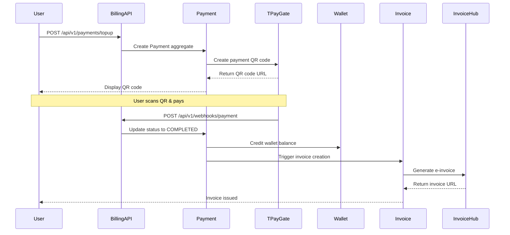

# Payment Topup to Invoice Flow

## Business Purpose
Enable tenants to top up their wallet balance through QR code payments and automatically generate electronic invoices upon successful payment.

## Actors
- **Tenant/User**: Initiates topup request
- **Billing Service**: Orchestrates payment processing
- **TPayGate**: External payment gateway
- **Invoice Hub**: Electronic invoice system

## Prerequisites
- Tenant exists and has an active wallet
- TPayGate integration is available
- Invoice Hub service is operational

## Workflow Diagram



## Workflow Steps

### Step 1: Initiate Payment
**Endpoint**: `POST /api/v1/payments/topup`

**Request**:
```json
{
  "amount": 100000,
  "currency": "VND",
  "paymentMethod": "QR",
  "returnUrl": "https://app.wion.vn/billing/return"
}
```

**Process**:
1. Validate request parameters
2. Create Payment aggregate (status: PENDING)
3. Call TPayGate API to create payment
4. Store gateway reference
5. Publish `PaymentCreated` event
6. Return QR code to user

**Related**: [Process Payment Use Case](../application/use-cases/process-payment.md)

---

### Step 2: User Completes Payment
**Process**:
1. User scans QR code with banking app
2. User authorizes payment
3. TPayGate processes payment
4. TPayGate sends webhook callback

**Duration**: Typically 1-5 minutes
**Timeout**: 15 minutes (payment auto-expires)

---

### Step 3: Handle Webhook Callback
**Endpoint**: `POST /api/v1/webhooks/payment`

**Request**:
```json
{
  "gatewayTransactionId": "TPG-12345",
  "eventType": "PAYMENT_SUCCESS",
  "paymentData": {
    "amount": 100000,
    "currency": "VND",
    "status": "COMPLETED",
    "transactionTime": "2026-07-04T10:05:00Z"
  },
  "timestamp": "2026-07-04T10:05:05Z"
}
```

**Process**:
1. Verify webhook signature
2. Load Payment aggregate by gateway reference
3. Update Payment status to COMPLETED
4. Publish `PaymentSucceeded` event

**Related**: [Handle Webhook Use Case](../application/use-cases/handle-webhook.md)

---

### Step 4: Credit Wallet Balance
**Process**:
1. Listen for `PaymentSucceeded` event
2. Load Wallet aggregate
3. Credit wallet with payment amount
4. Publish `BalanceChanged` event

**Business Rules**:
- Balance must be non-negative: `availableBalance >= 0`
- One wallet per tenant

**Related**: [Wallet Domain](../domains/wallet/)

---

### Step 5: Generate Invoice
**Process**:
1. Listen for `PaymentSucceeded` event
2. Create InvoiceReference aggregate
3. Call Invoice Hub API
4. Store invoice number and URL
5. Publish `InvoiceIssued` event

**Related**: [Invoice After Payment Policy](../policies/invoice-after-payment.md)

**Invoice Details**:
```json
{
  "invoiceNumber": "INV20260704001",
  "invoiceType": "BAN_HANG",
  "amount": 100000,
  "taxAmount": 10000,
  "totalAmount": 110000,
  "invoiceUrl": "https://invoice.wion.vn/INV20260704001.pdf"
}
```

---

## Error Handling

### Payment Timeout (15 minutes)
**Detection**: Payment still PENDING after 15 minutes

**Action**:
1. Update Payment status to EXPIRED
2. Publish `PaymentExpired` event
3. Notify user of payment expiry

---

### Payment Failed
**Detection**: Webhook with `eventType: PAYMENT_FAILED`

**Action**:
1. Update Payment status to FAILED
2. Publish `PaymentFailed` event
3. Notify user of payment failure

---

### Invoice Generation Failed
**Detection**: Invoice Hub API error or timeout

**Action**:
1. Update InvoiceReference status to FAILED
2. Publish `InvoiceFailed` event
3. Retry 3 times with exponential backoff
4. If all retries fail, move to DLQ for manual intervention

---

### Duplicate Webhook
**Detection**: Webhook with already-processed `gatewayTransactionId`

**Action**:
1. Return cached result
2. Publish `DuplicateWebhookDetected` event
3. Do not process again

---

## Alternative Flows

### A1: Insufficient Payment Amount
**Condition**: Amount < minimum required (10,000 VND)

**Action**:
1. Reject payment request with 400
2. Return error: "Amount must be at least 10,000 VND"

---

### A2: Invalid Payment Method
**Condition**: Payment method not supported

**Action**:
1. Reject payment request with 400
2. Return error: "Payment method not supported"

---

### A3: Webhook Signature Invalid
**Condition**: HMAC-SHA256 signature mismatch

**Action**:
1. Reject webhook with 403
2. Return error: "INVALID_SIGNATURE"
3. Log security event

---

## Postconditions

**On Success**:
- ✅ Payment status is COMPLETED
- ✅ Wallet balance credited
- ✅ Invoice generated and issued
- ✅ All events published
- ✅ Audit trail complete

**On Failure**:
- ❌ Payment status is FAILED or EXPIRED
- ❌ Wallet balance unchanged
- ❌ Invoice not generated
- ❌ Failure events published

---

## Performance Requirements

| Operation | Target | P95 |
|-----------|--------|-----|
| Payment initiation | < 500ms | < 1s |
| Webhook processing | < 200ms | < 500ms |
| Wallet crediting | < 100ms | < 300ms |
| Invoice generation | < 2s | < 5s |

---

## Monitoring

### Key Metrics
- Payment success rate (target: > 98%)
- Invoice generation success rate (target: > 99%)
- Average payment completion time
- Webhook processing latency

### Alerts
- Payment success rate < 95%
- Invoice generation failures > 1%
- Webhook processing P95 > 1s
- DLQ size > 100 events

---

## Related Use Cases

- [Process Payment](../application/use-cases/process-payment.md) - Step 1
- [Handle Webhook](../application/use-cases/handle-webhook.md) - Step 3
- [Create Invoice](../application/use-cases/create-invoice.md) - Step 5

---

## Related Aggregates

- [Payment Aggregate](../domains/payment/aggregate.md) - Payment tracking
- [Wallet Aggregate](../domains/wallet/aggregate.md) - Balance management
- [Invoice Aggregate](../domains/invoice/aggregate.md) - Invoice reference

---

## Related Policies

- [Invoice After Payment Policy](../policies/invoice-after-payment.md) - Triggers invoice generation

---

## Related Events

- `PaymentCreated` - Payment initiated
- `PaymentSucceeded` - Payment completed
- `PaymentFailed` - Payment failed
- `PaymentExpired` - Payment timeout
- `BalanceChanged` - Wallet credited
- `InvoiceIssued` - Invoice generated
- `InvoiceFailed` - Invoice generation failed

---

**Last Updated**: 2026-07-05
**Maintained By**: Billing Service Team
