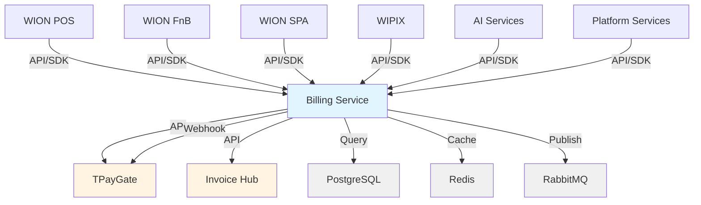

# Billing Service - Dependencies

## Overview
Billing Service has no upstream dependencies but integrates with external systems and is depended upon by multiple applications.

## Upstream Services
**None**

Billing Service is a **foundation service** with zero upstream service dependencies.

## Downstream Applications

### WION Products
**Relationship**: Consume credits via Billing APIs

**Applications**:
- WION POS - Point of Sale
- WION FnB - Food & Beverage
- WION SPA - Service Platform
- WIPIX - Media Platform
- AI Services - AI Generation, OCR
- Platform Services - SMS, Storage, Marketplace

**Integration Pattern**: Client SDK or direct REST API calls

---

### Client SDK
**Relationship**: Wraps Billing APIs for developer convenience

**Languages**:
- C# / .NET 6.0+ (Phase 1) - Complete
- Python (Phase 2) - Planned
- Go (Phase 3) - Planned
- Java (Phase 4) - Planned

**Features**:
- Simple API interface
- Built-in retry logic
- Error handling
- Type safety

**Documentation**: [SDK Documentation](./features/credit-consumption/sdk-guide.md)

---

## External Systems

### TPayGate
**Purpose**: Payment gateway for QR code payments

**Integration Type**: REST API + Webhooks

**APIs Used**:
- `POST {TPayGate}/api/v1/payments` - Create payment
- Webhook endpoint - Receive payment callbacks

**Security**: HMAC-SHA256 signature verification

**Retry Policy**: 3 attempts with exponential backoff

**SLA**: 99% availability

---

### Invoice Hub
**Purpose**: Electronic invoice generation system

**Integration Type**: REST API

**APIs Used**:
- `POST {InvoiceHub}/api/v1/invoices` - Create invoice
- `GET {InvoiceHub}/api/v1/invoices/{id}` - Get invoice status

**Retry Policy**: 3 attempts with exponential backoff (30s, 60s, 120s)

**Fallback**: Manual processing queue

**SLA**: 99% availability

---

## Infrastructure Dependencies

### Database (PostgreSQL)
**Type**: Relational Database

**Purpose**: Persistent data storage

**Configuration**:
- **Connection Pool**: 20 connections
- **Read Replicas**: 2 replicas
- **Backup**: Daily full backup + hourly incremental
- **Retention**: 7 years for ledger data

**Tables**:
- `wallet` - Wallet information
- `wallet_asset` - Asset types
- `payment` - Payment transactions
- `credit_transaction` - Credit operations
- `ledger` - Double-entry records
- `invoice_reference` - Invoice mappings
- `webhook_event` - Webhook logs

---

### Cache (Redis)
**Type**: In-memory key-value store

**Purpose**: Balance caching and session storage

**Configuration**:
- **TTL**: 60 seconds for balance data
- **Eviction**: LRU (Least Recently Used)
- **Persistence**: RDB + AOF enabled
- **Replication**: Master-slave setup

**Cache Keys**:
- `wallet:balance:{tenantId}` - Wallet balance
- `wallet:asset:{type}:{tenantId}` - Asset balance
- `payment:status:{paymentId}` - Payment status

---

### Message Queue (RabbitMQ)
**Type**: Message broker

**Purpose**: Async event publishing

**Configuration**:
- **Exchange**: `billing.events`
- **Queues**: Per service subscriptions
- **Durability**: Durable queues
- **Acknowledgment**: Manual ack

**Topics**:
- `billing.wallet.*` - Wallet events
- `billing.payment.*` - Payment events
- `billing.credit.*` - Credit events
- `billing.invoice.*` - Invoice events

---

## Dependency Diagram

## Security Dependencies

### Authentication Service (Future)
**Purpose**: API key validation and tenant authentication

**Integration**: OpenID Connect / OAuth 2.0

---

### Tenant Service (Future)
**Purpose**: Tenant existence validation

**Integration**: REST API

**API**: `GET /api/v1/tenants/{tenantId}`

---

## Monitoring Dependencies

### Prometheus
**Purpose**: Metrics collection

**Metrics**:
- API request rate
- API latency
- Error rate
- Cache hit rate
- Database connection pool

---

### Grafana
**Purpose**: Metrics visualization

**Dashboards**:
- Billing Service Overview
- Payment Processing
- Credit Operations
- Database Performance

---

## Related Documentation
- [Service Documentation](./service.md)
- [Database Schema](./database.md)
- [API Index](./api-index.md)
