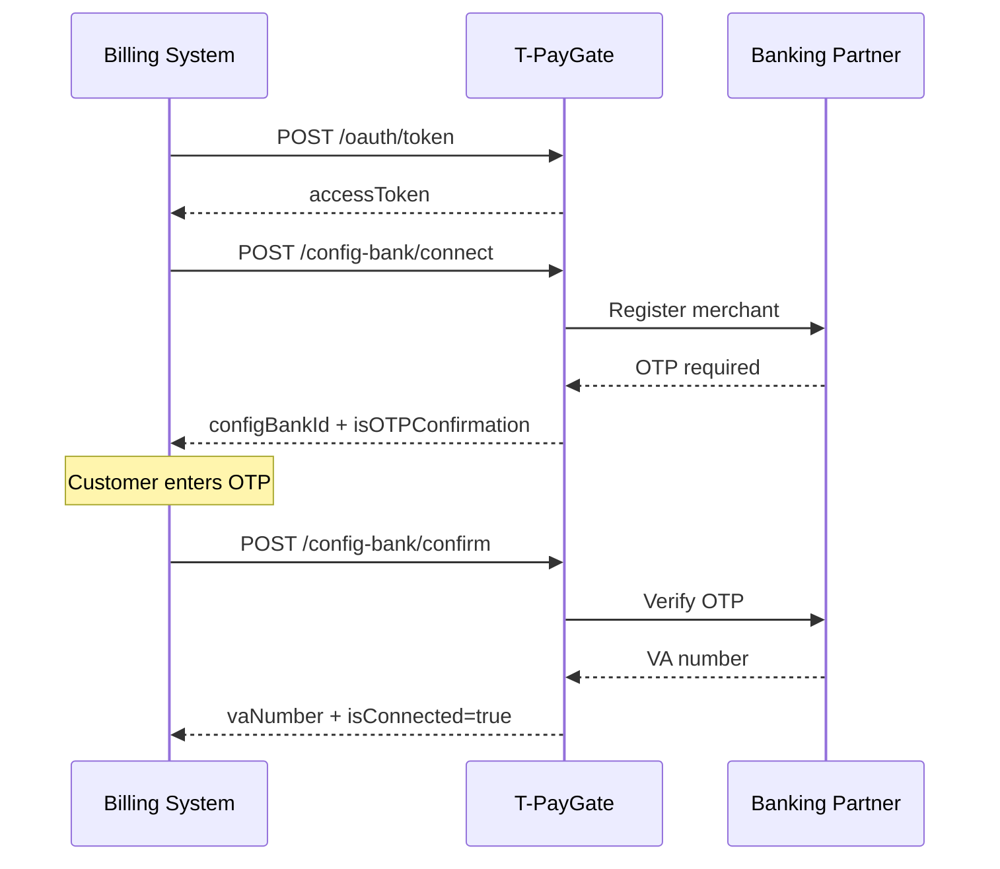
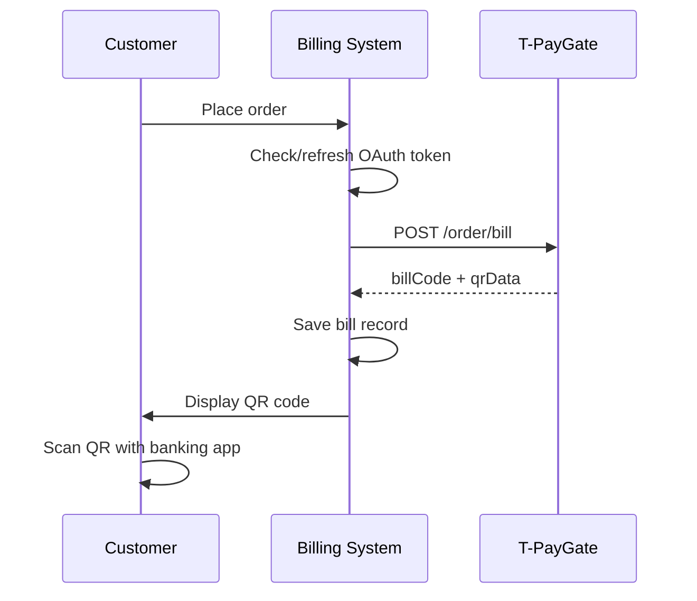
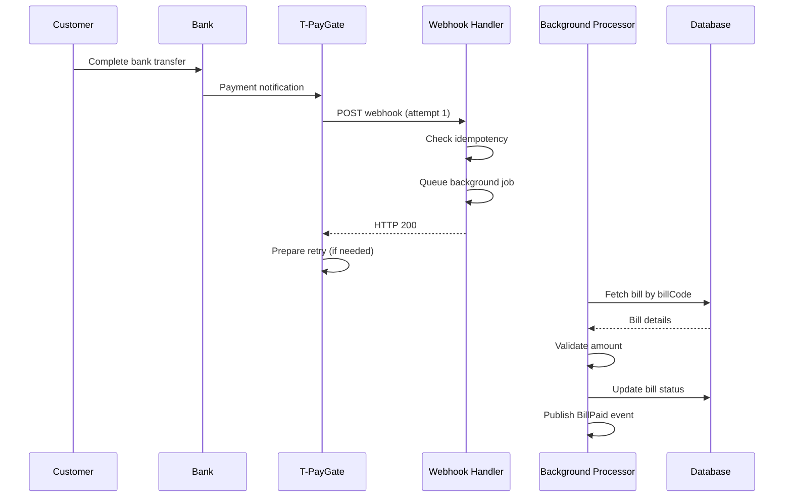

# T-PayGate Integration Flows

## Overview
End-to-end integration flows for T-PayGate payment gateway, covering bank connection, payment processing, and webhook handling.

---

## Flow 1: Initial Bank Connection Setup

### Purpose
Establish first-time connection between merchant and bank for payment processing.

### Participants
- Merchant/Billing System
- T-PayGate API
- Banking Partner

### Flow Diagram

```
┌─────────────────────────────────────────────────────────────────────────────┐
│                    Bank Connection Setup Flow                                 │
├─────────────────────────────────────────────────────────────────────────────┤
│                                                                            │
│  [1] OAuth Authentication                                                   │
│  ┌───────────────────────────────────────────────────────────────────────┐ │
│  │ Billing System                T-PayGate OAuth Service                   │ │
│  │     │                                      │                            │ │
│  │     POST /oauth/token                     │                            │ │
│  │     clientId + tenantId + source          │                            │ │
│  │     │────────────────────────────────────>│                            │ │
│  │     │                                      │ Validate credentials        │ │
│  │     │<─────────────────────────────────────│ accessToken + expiresIn    │ │
│  │     Cache token (TTL: 3600s)              │                            │ │
│  └───────────────────────────────────────────────────────────────────────┘ │
│                                                                            │
│  [2] Bank Connection Initiation                                             │
│  ┌───────────────────────────────────────────────────────────────────────┐ │
│  │ Billing System                T-PayGate              Bank               │ │
│  │     │                              │                   │                 │ │
│  │     POST /config-bank/connect     │                   │                 │ │
│  │     Bank details + merchant info   │                   │                 │ │
│  │     │─────────────────────────────>│                   │                 │ │
│  │     │                              │ Register merchant  │                 │ │
│  │     │                              │───────────────────>│                 │ │
│  │     │                              │                   │                 │ │
│  │     │                              │<───────────────────│ OTP required     │ │
│  │     │<─────────────────────────────│ isOTPConfirmation │                 │ │
│  │     Save configBankId              │                   │                 │ │
│  └───────────────────────────────────────────────────────────────────────┘ │
│                                                                            │
│  [3] OTP Verification (if required)                                        │
│  ┌───────────────────────────────────────────────────────────────────────┐ │
│  │ Customer                     T-PayGate              Bank               │ │
│  │     │                              │                   │                 │ │
│  │     Enter OTP from SMS             │                   │                 │ │
│  │     │                              │                   │                 │ │
│  │     POST /config-bank/confirm     │                   │                 │ │
│  │     configBankId + otpNumber       │                   │                 │ │
│  │     │─────────────────────────────>│                   │                 │ │
│  │     │                              │ Verify OTP         │                 │ │
│  │     │                              │───────────────────>│                 │ │
│  │     │                              │<───────────────────│ VA allocated     │ │
│  │     │<─────────────────────────────│ vaNumber           │                 │ │
│  │     Save vaNumber                  │ isConnected=true   │                 │ │
│  └───────────────────────────────────────────────────────────────────────┘ │
│                                                                            │
│  Result: Bank connection ready for payment processing                      │
└─────────────────────────────────────────────────────────────────────────────┘
```

### Sequence Diagram



### Key Business Rules
- One-time setup per merchant-bank pair
- OTP requirement varies by bank
- Virtual Account (VA) number allocated upon success
- Connection persists until explicitly disconnected

### Error Handling
- Invalid OTP: Allow retry (max 3 attempts)
- Expired OTP: Restart connection flow
- Bank API down: Retry with exponential backoff

---

## Flow 2: Payment Bill Creation

### Purpose
Create payment bill with QR code for customer to scan and pay.

### Participants
- Customer
- Billing System
- T-PayGate API

### Flow Diagram

```
┌─────────────────────────────────────────────────────────────────────────────┐
│                      Payment Bill Creation Flow                              │
├─────────────────────────────────────────────────────────────────────────────┤
│                                                                            │
│  [1] Order Creation                                                         │
│  ┌───────────────────────────────────────────────────────────────────────┐ │
│  │ Customer                  Billing System            T-PayGate           │ │
│  │     │                         │                         │                │ │
│  │     Place order              │                         │                │ │
│  │     │────────────────────────>│                         │                │ │
│  │     │                         │ Check token expiry      │                │ │
│  │     │                         │ Refresh if needed       │                │ │
│  └───────────────────────────────────────────────────────────────────────┘ │
│                                                                            │
│  [2] Bill Creation                                                          │
│  ┌───────────────────────────────────────────────────────────────────────┐ │
│  │ Billing System            T-PayGate                                   │ │
│  │     │                      │                                          │ │
│  │     POST /order/bill       │                                          │ │
│  │     refTransactionId       │                                          │ │
│  │     amount + description   │                                          │ │
│  │     configBankId (header)  │                                          │ │
│  │     │─────────────────────>│ Generate bill code                       │ │
│  │     │                      │ Generate QR code                         │ │
│  │     │<─────────────────────│ billCode + qrContent + qrImageBase64      │ │
│  │     Save bill record       │ Set expiry (24h)                          │ │
│  └───────────────────────────────────────────────────────────────────────┘ │
│                                                                            │
│  [3] QR Code Display                                                        │
│  ┌───────────────────────────────────────────────────────────────────────┐ │
│  │ Billing System            Customer                                    │ │
│  │     │                      │                                          │ │
│  │     Display QR code        │                                          │ │
│  │     Show payment amount    │                                          │ │
│  │     Show expiry time       │                                          │ │
│  │     │─────────────────────>│ Scan QR with banking app                 │ │
│  └───────────────────────────────────────────────────────────────────────┘ │
│                                                                            │
│  Result: Customer scans QR and initiates bank transfer                    │
└─────────────────────────────────────────────────────────────────────────────┘
```

### Sequence Diagram



### Key Business Rules
- refTransactionId must be unique per merchant (24h cache)
- Amount immutable once created
- Bill expires in 24 hours (default)
- QR code follows Vietnam QR National standard

### Error Handling
- Duplicate refTransactionId: Return existing bill (idempotent)
- Invalid configBankId: Return 404, require reconnection
- Token expired: Refresh token and retry

---

## Flow 3: Payment Processing with Webhook

### Purpose
Process payment notification from T-PayGate via webhook and update order status.

### Participants
- Customer
- Banking Partner
- T-PayGate
- Billing System Webhook Handler
- Billing System Background Processor

### Flow Diagram

```
┌─────────────────────────────────────────────────────────────────────────────┐
│                    Payment Processing with Webhook                           │
├─────────────────────────────────────────────────────────────────────────────┤
│                                                                            │
│  [1] Customer Payment                                                       │
│  ┌───────────────────────────────────────────────────────────────────────┐ │
│  │ Customer                  Bank                 T-PayGate                │ │
│  │     │                       │                      │                   │ │
│  │     Complete bank transfer│                      │                   │ │
│  │     │─────────────────────>│                      │                   │ │
│  │     │                       │                      │                   │ │
│  │     │                       │ Payment notification │                   │ │
│  │     │                       │──────────────────────>│                   │ │
│  │     │                       │                      │ Process payment     │ │
│  │     │                       │                      │ Prepare webhook     │ │
│  └───────────────────────────────────────────────────────────────────────┘ │
│                                                                            │
│  [2] Webhook Delivery (Attempt 1)                                           │
│  ┌───────────────────────────────────────────────────────────────────────┐ │
│  │ T-PayGate             Billing System Webhook Handler                   │ │
│  │     │                      │                                          │ │
│  │     POST webhook         │                                          │ │
│  │     BillCode + Amount    │                                          │ │
│  │     PaymentTime          │                                          │ │
│  │     │────────────────────>│                                          │ │
│  │     │                      │ Validate basic structure                 │ │
│  │     │                      │ Check idempotency by billCode              │ │
│  │     │                      │ Queue background job                      │ │
│  │     │<────────────────────│ HTTP 200 (immediate)                      │ │
│  └───────────────────────────────────────────────────────────────────────┘ │
│                                                                            │
│  [3] Background Payment Processing                                        │
│  ┌───────────────────────────────────────────────────────────────────────┐ │
│  │ Background Processor         Database                  Domain          │ │
│  │     │                          │                        │              │ │
│  │     Process payment job       │                        │              │ │
│  │     │                          │                        │              │ │
│  │     Fetch bill by billCode    │                        │              │ │
│  │     │<─────────────────────────│                        │              │ │
│  │     │                          │                        │              │ │
│  │     Validate amount           │                        │              │ │
│  │     Update bill status        │                        │              │ │
│  │     │─────────────────────────>│                        │              │ │
│  │     │                          │                        │              │ │
│  │     Publish: BillPaid         │                        │              │ │
│  │     │                          │                        │              │ │
│  │     Trigger: Invoice generation, ledger recording, wallet credit        │ │
│  └───────────────────────────────────────────────────────────────────────┘ │
│                                                                            │
│  [4] Webhook Retry (if needed)                                             │
│  ┌───────────────────────────────────────────────────────────────────────┐ │
│  │ If webhook endpoint times out or returns non-200:                      │ │
│  │                                                                         │ │
│  │ T-PayGate retries:                                                      │ │
│  │ - Attempt 2: +5 minutes                                                │ │
│  │ - Attempt 3: +5 minutes                                                │ │
│  │ - Total window: 10 minutes                                              │ │
│  │                                                                         │ │
│  │ Our system: Handle idempotently - duplicate webhooks return HTTP 200   │ │
│  └───────────────────────────────────────────────────────────────────────┘ │
│                                                                            │
│  [5] Fallback Polling (if webhook fails)                                   │
│  ┌───────────────────────────────────────────────────────────────────────┐ │
│  │ Background Polling Job (every 15 minutes):                             │ │
│  │                                                                         │ │
│  │ Polling Job               T-PayGate                     Database       │ │
│  │     │                          │                            │            │ │
│  │     Query unpaid bills       │                            │            │ │
│  │     │<───────────────────────│                            │            │
│  │     │                          │                            │            │ │
│  │     For each unpaid bill:    │                            │            │ │
│  │     GET /order/get-billCode   │                            │            │ │
│  │     │────────────────────────>│                            │            │ │
│  │     |<────────────────────────│ Status + payment info      │            │ │
│  │     |                          │                            │            │ │
│  │     If status = PAID:        │                            │            │
│  │     Process as webhook received                             │            │
│  │     │────────────────────────────────────────────────────>│            │ │
│  └───────────────────────────────────────────────────────────────────────┘ │
│                                                                            │
│  Result: Payment processed, order fulfilled, downstream systems notified    │
└─────────────────────────────────────────────────────────────────────────────┘
```

### Sequence Diagram



### Key Business Rules
- Webhook must respond < 10 seconds (PROD)
- Idempotency by billCode mandatory
- Amount validation: webhook amount must match bill amount
- Retry pattern: 3 attempts × 5-minute intervals

### Error Handling
- Webhook timeout: T-PayGate retries
- Webhook processing failure: Background job retry
- All retries exhausted: Alert operations, trigger fallback polling

---

## Flow 4: Token Refresh

### Purpose
Maintain valid OAuth token for API calls.

### Participants
- Billing System
- T-PayGate OAuth Service

### Flow Diagram

```
┌─────────────────────────────────────────────────────────────────────────────┐
│                         Token Refresh Flow                                    │
├─────────────────────────────────────────────────────────────────────────────┤
│                                                                            │
│  [Proactive Refresh] (Recommended)                                         │
│  ┌───────────────────────────────────────────────────────────────────────┐ │
│  │ Background Job (every 1 minute):                                        │ │
│  │                                                                         │ │
│  │ Token Manager                T-PayGate OAuth                            │ │
│  │     │                              │                                    │ │
│  │     Check all cached tokens      │                                    │ │
│  │     |                              │                                    │ │
│  │     If token expires in < 5 min:│                                    │ │
│  │     |                              │                                    │ │
│  │     POST /oauth/token            │                                    │ │
│  │     │────────────────────────────>│ Generate new token                  │ │
│  │     |<────────────────────────────│ accessToken + expiresIn             │ │
│  │     Update cache atomically       │                                    │ │
│  └───────────────────────────────────────────────────────────────────────┘ │
│                                                                            │
│  [Reactive Refresh] (Fallback)                                             │
│  ┌───────────────────────────────────────────────────────────────────────┐ │
│  │ API Call                    Token Manager         T-PayGate OAuth       │ │
│  │     │                            │                     │                │ │
│  │     Call API with token         │                     │                │ │
│  │     │────────────────────────────>│                     │                │ │
│  │     |<────────────────────────────│ HTTP 401             │                │ │
│  │     |                            │                     │                │ │
│  │     |                            | Refresh immediately  │                │ │
│  │     |                            |─────────────────────>│                │ │
│  │     |                            |<─────────────────────│ New token       │ │
│  │     |                            | Update cache        │                │ │
│  │     |                            |                     │                │ │
│  │     Retry API call with new token                                          │
│  │     │────────────────────────────>│                     │                │ │
│  │     |<────────────────────────────│ HTTP 200             │                │ │
│  └───────────────────────────────────────────────────────────────────────┘ │
│                                                                            │
│  Result: Valid token maintained for all API calls                            │
└─────────────────────────────────────────────────────────────────────────────┘
```

### Key Business Rules
- Proactive refresh at T-5 minutes
- Reactive refresh on 401 response
- Distributed locking for concurrent refresh requests
- Cache token in memory (not persisted)

---

## Flow 5: Bill Expiry Handling

### Purpose
Handle bills that expire without payment.

### Participants
- Background Expiry Job
- Database
- Monitoring Service

### Flow Diagram

```
┌─────────────────────────────────────────────────────────────────────────────┐
│                       Bill Expiry Handling Flow                              │
├─────────────────────────────────────────────────────────────────────────────┤
│                                                                            │
│  Background Expiry Job (every 5 minutes):                                  │
│  ┌───────────────────────────────────────────────────────────────────────┐ │
│  │ Expiry Job                 Database                    Domain          │ │
│  │     │                          │                        │              │ │
│  │     Query bills where:       │                        │              │ │
│  │     status = CREATED OR WAITING_PAYMENT                       │              │ │
│  │     AND expired_at < now      │                        │              │ │
│  │     │<─────────────────────────│                        │              │ │
│  │     │                          │                        │              │ │
│  │     For each expired bill:   │                        │              │ │
│  │     MarkAsExpired()           │                        │              │ │
│  │     │─────────────────────────>│                        │              │ │
│  │     │                          │                        │              │ │
│  │     Publish: BillExpired      │                        │              │ │
│  │     |                          │                        │              │ │
│  │     Notify monitoring service  │                        │              │ │
│  └───────────────────────────────────────────────────────────────────────┘ │
│                                                                            │
│  Result: Expired bills marked, monitoring notified                          │
└─────────────────────────────────────────────────────────────────────────────┘
```

---

## Flow 6: Bank Disconnection

### Purpose
Terminate bank connection and prevent new payments.

### Participants
- Merchant/Admin
- Billing System
- T-PayGate
- Banking Partner

### Flow Diagram

```
┌─────────────────────────────────────────────────────────────────────────────┐
│                       Bank Disconnection Flow                                 │
├─────────────────────────────────────────────────────────────────────────────┤
│                                                                            │
│  [1] Disconnect Request                                                      │
│  ┌───────────────────────────────────────────────────────────────────────┐ │
│  │ Admin/Merchant             Billing System          T-PayGate          │ │
│  │     │                          │                       │               │ │
│  │     Request disconnect        │                       │               │ │
│  │     configBankId              │                       │               │ │
│  │     │────────────────────────>│                       │               │ │
│  │     │                          │                       │               │ │
│  │     POST /disconnect           │                       │               │ │
│  │     │─────────────────────────────────────────────────>│               │ │
│  │     |                          │                       │               │ │
│  │     |                          │<──────────────────────│ Success         │ │
│  │     |                          │ Call bank API         │               │ │
│  │     |                          │──────────────────────>│ Revoke access  │ │
│  │     |                          │<──────────────────────│ OK             │ │
│  │     |                          │                       │               │ │
│  │     Update connection:        │                       │               │ │
│  │     isConnected = false       │                       │               │ │
│  │     Keep record for reconciliation                                    │ │
│  │     |<────────────────────────│                       │               │ │
│  │     Confirm disconnect         │                       │               │ │
│  └───────────────────────────────────────────────────────────────────────┘ │
│                                                                            │
│  [2] Impact Analysis                                                         │
│  ┌───────────────────────────────────────────────────────────────────────┐ │
│  │ Existing bills:                                                         │ │
│  │ - Created bills can still be paid (if not expired)                     │ │
│  │ - Active payments continue processing                                   │ │
│  │                                                                         │ │
│  │ New bills:                                                               │ │
│  │ - Cannot create new bills with disconnected bank                        │ │
│  │ - Return error: Connection not active                                   │ │
│  │ - Suggest: Reconnect or use alternative bank                            │ │
│  └───────────────────────────────────────────────────────────────────────┘ │
│                                                                            │
│  Result: Bank connection terminated, new payments blocked                    │
└─────────────────────────────────────────────────────────────────────────────┘
```

---

## Flow 7: Daily Reconciliation

### Purpose
Reconcile T-PayGate payments with internal records.

### Participants
- Reconciliation Job
- T-PayGate Reconciliation File
- Database
- Monitoring Service

### Flow Diagram

```
┌─────────────────────────────────────────────────────────────────────────────┐
│                      Daily Reconciliation Flow                               │
├─────────────────────────────────────────────────────────────────────────────┤
│                                                                            │
│  [Daily Reconciliation Job]                                                 │
│  ┌───────────────────────────────────────────────────────────────────────┐ │
│  │ Reconciliation Job        T-PayGate             Database               │ │
│  │     │                           │                    │                  │ │
│  │     Run daily at 2 AM          │                    │                  │ │
│  │     |                           │                    │                  │ │
│  │     Fetch reconciliation file  │                    │                  │ │
│  │     |<──────────────────────────│                    │                  │ │
│  │     |                           │                    │                  │ │
│  │     Parse file (TBD format)    │                    │                  │ │
│  │     |                           │                    │                  │ │
│  │     For each payment:          │                    │                  │ │
│  │     |                           │                    │                  │ │
│  │     Query our records          │                    │                  │ │
│  │     |<──────────────────────────────────────────────│                  │ │
│  │     |                           │                    │                  │ │
│  │     Compare:                   │                    │                  │ │
│  │     - BillCode matches?        │                    │                  │ │
│  │     - Amount matches?          │                    │                  │ │
│  │     - PaymentTime matches?     │                    │                  │ │
│  │     |                           │                    │                  │ │
│  │     If discrepancy:            │                    │                  │ │
│  │     Log discrepancy report      │                    │                  │ │
│  │     Alert operations team       │                    │                  │ │
│  └───────────────────────────────────────────────────────────────────────┘ │
│                                                                            │
│  Result: Reconciliation report, discrepancies alerted                         │
└─────────────────────────────────────────────────────────────────────────────┘
```

---

## Flow State Machines

### Bank Connection State Machine

```
INITIATED ──(OTP required)──> PENDING_OTP ──(OTP verified)──> CONNECTED
    │                                                               │
    │                   (No OTP required)                            │
    └──────────────────────────────────────────────────────────────┘
                                                                    │
                                                                    └───(Disconnect)──> DISCONNECTED
```

### Bill State Machine

```
CREATED ──(Customer scans QR)──> WAITING_PAYMENT ──(Payment received)──> PAID
    │                                      │
    │                                      └───(Timeout)──> EXPIRED
    │
    └───(Merchant cancels)───────────────────────────────────────> CANCELED
```

### Webhook Processing State Machine

```
RECEIVED ──(Idempotency check)──> PROCESSING ──(Success)──> PROCESSED
    │                                         │
    │                                         └───(Failure)──> FAILED
    │
    └───(Duplicate)─────────────────────────────────────────> DUPLICATE
```

---

## Related Documents
- [T-PayGate Domain Overview](../../domains/payment/tpaygate/overview.md) - Domain context
- [T-PayGate API Documentation](../../api/external/tpaygate.md) - API reference
- [T-PayGate Aggregates](../../domains/payment/tpaygate/aggregates.md) - Aggregate state machines
- [T-PayGate Resiliency Patterns](../../infrastructure/tpaygate-resiliency.md) - Retry and circuit breaker flows
